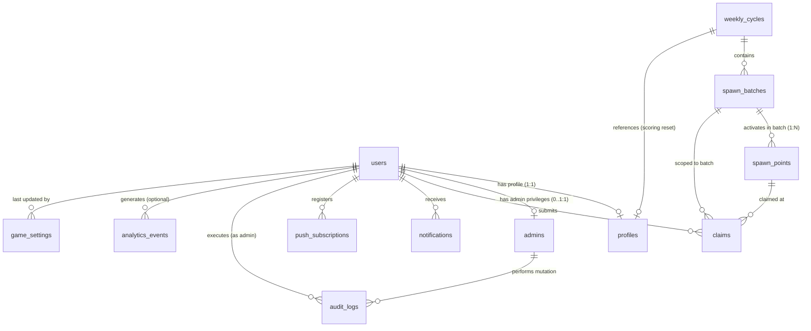

# Campus Run (Project I9) — Relational Database Schema Specification

> **Status:** Phase 03 Complete — Schema Integrity Audited & Production Ready  
> **Database Engine:** PostgreSQL 16+ (tested on PostgreSQL 18.1) with native spatial indexing (GiST) & PostGIS compatibility  
> **Spatial Reference:** WGS 84 (`SRID 4326`) using `point(lng, lat)` geometric type with GiST spatial indexing  
> **Temporal Standard:** UTC (`TIMESTAMPTZ` with `NOW()`)  
> **Security & Access:** Least-privilege runtime role (`i9_app_user`), DDL migration role (`i9_migrator`)  

---

## 1. Executive Summary & Design Principles

This document establishes the audited, production-grade relational database schema for **Project I9** across all 12 core tables:
1. `users` — Canonical user identity & authentication credentials
2. `profiles` — Player public gameplay profile, stats, and streaks (1:1 with `users`)
3. `admins` — Privileged administration roles & permissions (independent from player profiles)
4. `weekly_cycles` — Time-bounded scoring and competitive leaderboard periods
5. `spawn_batches` — Rotation batches governing active spawn lifecycles
6. `spawn_points` — Campus-wide physical and virtual spawn targets with geodetic coordinates
7. `claims` — Immutable claim receipts with anti-double-claim database guarantees
8. `notifications` — Targeted player notifications with polymorphic entity links
9. `push_subscriptions` — Multi-device Web Push / browser subscription endpoints
10. `game_settings` — Runtime configurable game engine parameters & singleton configurations
11. `audit_logs` — Tamper-evident admin action audit trail (free of secrets & credentials)
12. `analytics_events` — High-throughput append-only telemetry stream isolated from game state

### Core Architectural Guarantees
- **Geospatial Rigor:** Points stored as `point` in canonical longitude-first `(lng, lat)` order, with stored generated `lat` and `lng` columns and GiST spatial indexing (`idx_spawns_location_gist`) for bounding box and geofence proximity searches.
- **Strict Anti-Duplicate State:** Database-level uniqueness constraints make race-condition exploits (e.g. claiming the same spawn twice in one rotation batch) structurally impossible.
- **Explicit Foreign Key Cascades:** `ON DELETE CASCADE` is reserved for tight child lifecycle tables (`profiles`, `push_subscriptions`, `notifications`). Transactional and historical state (`claims`, `audit_logs`, `spawn_points`) utilizes `ON DELETE RESTRICT` or `SET NULL` to prevent accidental history loss.
- **Strict Bounds & Integrity:** Every integer, string code, enum state, and spatial boundary is bounded by deliberate `CHECK` constraints.
- **Justified Indexes:** Exactly 33 indexes are maintained across the 12 tables, each backing a verified application query path.

---

## 2. Entity-Relationship (ER) Architecture



---

## 3. Complete Table & Column Specifications

### 3.1 `users`
Represents core identity and authentication credentials. Player profile data is deliberately segregated into `profiles`.

| Column | Data Type | Nullable | Default | Constraints & References | Description |
| :--- | :--- | :--- | :--- | :--- | :--- |
| `id` | `UUID` | **NO** | `gen_random_uuid()` | `PRIMARY KEY` | Immutable internal user identifier |
| `email` | `VARCHAR(255)` | **NO** | *None* | `UNIQUE`, `CHECK (length(email) >= 5)` | Normalized lowercase login email address |
| `password_hash` | `VARCHAR(255)` | **YES** | *None* | *None* | Argon2id/Bcrypt hash (nullable for OAuth2/SSO users) |
| `status` | `VARCHAR(20)` | **NO** | `'active'` | `CHECK (status IN ('active', 'suspended', 'deactivated'))` | Account lifecycle state |
| `email_verified_at` | `TIMESTAMPTZ`| **YES** | *None* | *None* | Timestamp of email verification confirmation |
| `created_at` | `TIMESTAMPTZ`| **NO** | `NOW()` | *None* | Account creation timestamp (UTC) |
| `updated_at` | `TIMESTAMPTZ`| **NO** | `NOW()` | *None* | Record last update timestamp (UTC) |

- **Foreign Keys:** None.
- **Deletion Behavior:** Deleting a user cascades on personal sub-resources (`profiles`, `push_subscriptions`, `notifications`). Deleting a user with existing `claims` or `audit_logs` is restricted (`RESTRICT`) to preserve historical and competitive integrity.

---

### 3.2 `profiles`
Represents the public gaming persona and progression statistics for a player. Maintains a strict 1-to-1 relationship with `users`.

| Column | Data Type | Nullable | Default | Constraints & References | Description |
| :--- | :--- | :--- | :--- | :--- | :--- |
| `user_id` | `UUID` | **NO** | *None* | `PRIMARY KEY`, `REFERENCES users(id) ON DELETE CASCADE` | 1:1 reference to the identity record |
| `username` | `VARCHAR(30)` | **NO** | *None* | `UNIQUE`, `CHECK (username ~ '^[a-zA-Z0-9_]{3,30}$')` | Public leaderboard handle (alphanumeric + underscore) |
| `display_name` | `VARCHAR(50)` | **YES** | *None* | *None* | Optional friendly display name |
| `avatar_url` | `VARCHAR(512)` | **YES** | *None* | *None* | URL to player profile avatar image |
| `total_points` | `INT` | **NO** | `0` | `CHECK (total_points >= 0)` | All-time cumulative points earned |
| `season_points` | `INT` | **NO** | `0` | `CHECK (season_points >= 0)` | Points earned in the active weekly cycle |
| `claims_count` | `INT` | **NO** | `0` | `CHECK (claims_count >= 0)` | Total successful point claims completed |
| `current_streak_days` | `INT` | **NO** | `0` | `CHECK (current_streak_days >= 0)` | Consecutive active play days |
| `longest_streak_days` | `INT` | **NO** | `0` | `CHECK (longest_streak_days >= 0)` | Historical personal best streak |
| `last_streak_claim_at`| `TIMESTAMPTZ`| **YES** | *None* | *None* | Timestamp of most recent streak-qualifying claim |
| `last_active_at` | `TIMESTAMPTZ`| **NO** | `NOW()` | *None* | Timestamp of player's last game interaction |
| `created_at` | `TIMESTAMPTZ`| **NO** | `NOW()` | *None* | Profile creation timestamp (UTC) |
| `updated_at` | `TIMESTAMPTZ`| **NO** | `NOW()` | *None* | Profile last update timestamp (UTC) |

- **Foreign Keys:**
  - `user_id` -> `users(id)` `ON DELETE CASCADE`
- **Integrity Rules:**
  - `CHECK (longest_streak_days >= current_streak_days)` enforces streak consistency.

---

### 3.3 `admins`
Stores administrative roles and elevated platform privileges. Decoupled completely from player gameplay profiles so admin duties do not pollute player leaderboard mechanics.

| Column | Data Type | Nullable | Default | Constraints & References | Description |
| :--- | :--- | :--- | :--- | :--- | :--- |
| `user_id` | `UUID` | **NO** | *None* | `PRIMARY KEY`, `REFERENCES users(id) ON DELETE CASCADE` | Reference to the authorized user |
| `role` | `VARCHAR(20)` | **NO** | `'admin'` | `CHECK (role IN ('moderator', 'admin', 'superadmin'))` | Administrative privilege tier |
| `granted_by` | `UUID` | **YES** | *None* | `REFERENCES users(id) ON DELETE SET NULL` | Administrator who conferred this role |
| `granted_at` | `TIMESTAMPTZ`| **NO** | `NOW()` | *None* | Timestamp when privilege was granted |
| `revoked_at` | `TIMESTAMPTZ`| **YES** | *None* | *None* | Optional revocation timestamp (soft-revoke) |

- **Foreign Keys:**
  - `user_id` -> `users(id)` `ON DELETE CASCADE`
  - `granted_by` -> `users(id)` `ON DELETE SET NULL`

---

### 3.4 `weekly_cycles`
Defines explicit, contiguous weekly competitive scoring periods. Provides unambiguous start and end boundaries for leaderboard rotations, resets, and historical archiving.

| Column | Data Type | Nullable | Default | Constraints & References | Description |
| :--- | :--- | :--- | :--- | :--- | :--- |
| `id` | `UUID` | **NO** | `gen_random_uuid()` | `PRIMARY KEY` | Unique cycle identifier |
| `cycle_number` | `INT` | **NO** | *None* | `UNIQUE`, `CHECK (cycle_number > 0)` | Monotonically increasing week sequence number |
| `starts_at` | `TIMESTAMPTZ`| **NO** | *None* | *None* | Exact cycle start timestamp (UTC) |
| `ends_at` | `TIMESTAMPTZ`| **NO** | *None* | *None* | Exact cycle termination timestamp (UTC) |
| `status` | `VARCHAR(20)` | **NO** | `'upcoming'` | `CHECK (status IN ('upcoming', 'active', 'completed', 'archived'))` | Cycle lifecycle state |
| `finalized_at` | `TIMESTAMPTZ`| **YES** | *None* | *None* | Timestamp when final leaderboard was frozen |
| `created_at` | `TIMESTAMPTZ`| **NO** | `NOW()` | *None* | Cycle creation timestamp |

- **Constraints:**
  - `CHECK (ends_at > starts_at)` ensures positive duration.
  - Exactly one cycle may have `status = 'active'` at any point in time (guaranteed by partial unique index `idx_weekly_cycles_unique_active`).

---

### 3.5 `spawn_batches`
Represents an active or historical rotation batch of spawns. Individual active spawns are linked to exactly one rotation batch.

| Column | Data Type | Nullable | Default | Constraints & References | Description |
| :--- | :--- | :--- | :--- | :--- | :--- |
| `id` | `UUID` | **NO** | `gen_random_uuid()` | `PRIMARY KEY` | Unique batch identifier |
| `batch_number` | `INT` | **NO** | *None* | `UNIQUE`, `CHECK (batch_number > 0)` | Monotonically increasing batch sequence |
| `cycle_id` | `UUID` | **NO** | *None* | `REFERENCES weekly_cycles(id) ON DELETE RESTRICT` | Associated weekly competition cycle |
| `started_at` | `TIMESTAMPTZ`| **NO** | `NOW()` | *None* | Batch activation timestamp (UTC) |
| `expires_at` | `TIMESTAMPTZ`| **NO** | *None* | *None* | Batch expiration timestamp (UTC) |
| `is_active` | `BOOLEAN` | **NO** | `true` | *None* | Boolean flag for quick active batch filtering |
| `created_at` | `TIMESTAMPTZ`| **NO** | `NOW()` | *None* | Record creation timestamp |

- **Constraints:**
  - `CHECK (expires_at > started_at)` ensures valid time window.
  - `cycle_id` uses `ON DELETE RESTRICT` so scoring history cannot be orphaned.

---

### 3.6 `spawn_points`
Physical and virtual game locations distributed across the campus. Stores precise WGS 84 geodetic coordinates as native points and visual SVG map offsets.

| Column | Data Type | Nullable | Default | Constraints & References | Description |
| :--- | :--- | :--- | :--- | :--- | :--- |
| `id` | `UUID` | **NO** | `gen_random_uuid()` | `PRIMARY KEY` | Unique spawn identifier |
| `code` | `VARCHAR(32)` | **NO** | *None* | `UNIQUE`, `CHECK (length(code) >= 3)` | Human-readable unique spawn code (e.g., `SPW-LIB-01`) |
| `batch_id` | `UUID` | **YES** | *None* | `REFERENCES spawn_batches(id) ON DELETE SET NULL` | Currently assigned rotation batch |
| `title` | `VARCHAR(100)` | **NO** | *None* | *None* | Landmark or spawn location name |
| `description` | `TEXT` | **YES** | *None* | *None* | Public contextual description |
| `clue` | `TEXT` | **YES** | *None* | *None* | Cryptic hint or navigational clue for players |
| `tier` | `VARCHAR(20)` | **NO** | `'tier1'` | `CHECK (tier IN ('tier1', 'tier2', 'tier3', 'tier4'))` | Reward tier category |
| `points` | `INT` | **NO** | `100` | `CHECK (points > 0)` | Base score value awarded upon claiming |
| `claim_radius_meters` | `FLOAT8` | **NO** | `25.0` | `CHECK (claim_radius_meters >= 5.0 AND claim_radius_meters <= 150.0)` | Geofence verification radius in meters |
| `location` | `point` | **NO** | *None* | *None* | Authoritative WGS 84 coordinate in `(lng, lat)` |
| `lat` | `double precision` | **NO** | `STORED` | `GENERATED ALWAYS AS (location[1])` | Latitude projection component |
| `lng` | `double precision` | **NO** | `STORED` | `GENERATED ALWAYS AS (location[0])` | Longitude projection component |
| `svg_x` | `INT` | **NO** | `0` | `CHECK (svg_x >= 0)` | Campus SVG map X coordinate offset |
| `svg_y` | `INT` | **NO** | `0` | `CHECK (svg_y >= 0)` | Campus SVG map Y coordinate offset |
| `status` | `VARCHAR(20)` | **NO** | `'active'` | `CHECK (status IN ('active', 'claimed', 'cooldown', 'expired'))` | Realtime gameplay availability state |
| `enabled` | `BOOLEAN` | **NO** | `true` | *None* | Administrative master enable switch |
| `claim_count` | `INT` | **NO** | `0` | `CHECK (claim_count >= 0)` | Cumulative claims completed on this spawn |
| `max_claims` | `INT` | **YES** | *None* | `CHECK (max_claims IS NULL OR max_claims > 0)` | Optional maximum claim threshold (first-come) |
| `created_at` | `TIMESTAMPTZ`| **NO** | `NOW()` | *None* | Record creation timestamp |
| `updated_at` | `TIMESTAMPTZ`| **NO** | `NOW()` | *None* | Record last modification timestamp |

- **Foreign Keys:**
  - `batch_id` -> `spawn_batches(id)` `ON DELETE SET NULL` (allows spawns to outlive ephemeral rotation batches).

---

### 3.7 `claims`
The authoritative, immutable ledger of all successful player claims. Enforces anti-cheat and single-claim constraints at the relational level.

| Column | Data Type | Nullable | Default | Constraints & References | Description |
| :--- | :--- | :--- | :--- | :--- | :--- |
| `id` | `UUID` | **NO** | `gen_random_uuid()` | `PRIMARY KEY` | Unique claim transaction receipt ID |
| `player_id` | `UUID` | **NO** | *None* | `REFERENCES users(id) ON DELETE RESTRICT` | Claiming player user ID |
| `spawn_id` | `UUID` | **NO** | *None* | `REFERENCES spawn_points(id) ON DELETE RESTRICT` | Claimed spawn point ID |
| `batch_id` | `UUID` | **NO** | *None* | `REFERENCES spawn_batches(id) ON DELETE RESTRICT` | Rotation batch in which claim occurred |
| `points_awarded` | `INT` | **NO** | *None* | `CHECK (points_awarded > 0)` | Actual score points awarded |
| `streak_multiplier` | `NUMERIC(3,2)` | **NO** | `1.00` | `CHECK (streak_multiplier >= 1.00 AND streak_multiplier <= 5.00)` | Streak bonus multiplier applied |
| `distance_meters`| `FLOAT8` | **NO** | *None* | `CHECK (distance_meters >= 0.0)` | Verified physical distance at moment of claim |
| `player_location`| `point` | **NO** | *None* | *None* | Recorded GPS location of player upon submission |
| `player_lat` | `double precision` | **NO** | `STORED` | `GENERATED ALWAYS AS (player_location[1])` | Latitude projection |
| `player_lng` | `double precision` | **NO** | `STORED` | `GENERATED ALWAYS AS (player_location[0])` | Longitude projection |
| `claimed_at` | `TIMESTAMPTZ`| **NO** | `NOW()` | *None* | Precise UTC timestamp of claim completion |

- **Foreign Keys:**
  - `player_id` -> `users(id)` `ON DELETE RESTRICT`
  - `spawn_id` -> `spawn_points(id)` `ON DELETE RESTRICT`
  - `batch_id` -> `spawn_batches(id)` `ON DELETE RESTRICT`
- **Crucial Uniqueness Constraint:**
  - `CONSTRAINT uq_claims_player_spawn_batch UNIQUE (player_id, spawn_id, batch_id)`

---

### 3.8 `notifications`
Direct in-app notification messages delivered to players. Supports polymorphic entity references to link alerts directly to spawns, cycles, or achievements safely.

| Column | Data Type | Nullable | Default | Constraints & References | Description |
| :--- | :--- | :--- | :--- | :--- | :--- |
| `id` | `UUID` | **NO** | `gen_random_uuid()` | `PRIMARY KEY` | Unique notification message ID |
| `user_id` | `UUID` | **NO** | *None* | `REFERENCES users(id) ON DELETE CASCADE` | Targeted recipient |
| `type` | `VARCHAR(50)` | **NO** | *None* | `CHECK (type IN ('spawn_rotation', 'claim_reward', 'streak_reminder', 'leaderboard_rank', 'system_announcement'))` | Message category identifier |
| `title` | `VARCHAR(255)` | **NO** | *None* | *None* | Notification title headline |
| `body` | `TEXT` | **NO** | *None* | *None* | Formatted message body text |
| `read` | `BOOLEAN` | **NO** | `false` | *None* | Read receipt status indicator |
| `read_at` | `TIMESTAMPTZ`| **YES** | *None* | *None* | Timestamp when player opened the alert |
| `entity_type` | `VARCHAR(50)` | **YES** | *None* | `CHECK (entity_type IS NULL OR entity_type IN ('spawn_point', 'spawn_batch', 'weekly_cycle', 'claim'))` | Optional target entity model type |
| `entity_id` | `UUID` | **YES** | *None* | *None* | Optional target entity UUID |
| `created_at` | `TIMESTAMPTZ`| **NO** | `NOW()` | *None* | Notification dispatch timestamp (UTC) |

- **Foreign Keys:**
  - `user_id` -> `users(id)` `ON DELETE CASCADE`

---

### 3.9 `push_subscriptions`
Stores Web Push Protocol subscription tokens. Allows a single player to receive notifications across multiple devices.

| Column | Data Type | Nullable | Default | Constraints & References | Description |
| :--- | :--- | :--- | :--- | :--- | :--- |
| `id` | `UUID` | **NO** | `gen_random_uuid()` | `PRIMARY KEY` | Unique subscription identifier |
| `user_id` | `UUID` | **NO** | *None* | `REFERENCES users(id) ON DELETE CASCADE` | Associated player account |
| `endpoint` | `TEXT` | **NO** | *None* | `UNIQUE` | Browser push service gateway URI |
| `p256dh` | `TEXT` | **NO** | *None* | *None* | Client public cryptographic key (base64url) |
| `auth` | `TEXT` | **NO** | *None* | *None* | Client authentication secret (base64url) |
| `user_agent` | `VARCHAR(255)` | **YES** | *None* | *None* | Device/browser identification string |
| `created_at` | `TIMESTAMPTZ`| **NO** | `NOW()` | *None* | Registration timestamp |
| `updated_at` | `TIMESTAMPTZ`| **NO** | `NOW()` | *None* | Last endpoint verification timestamp |

- **Foreign Keys:**
  - `user_id` -> `users(id)` `ON DELETE CASCADE`

---

### 3.10 `game_settings`
Dynamic runtime configuration storage for game balance parameters. Operates as a typed key-value catalog with schema validation.

| Column | Data Type | Nullable | Default | Constraints & References | Description |
| :--- | :--- | :--- | :--- | :--- | :--- |
| `key` | `VARCHAR(64)` | **NO** | *None* | `PRIMARY KEY`, `CHECK (key ~ '^[a-z0-9_.]+$')` | Canonical configuration parameter key |
| `value` | `JSONB` | **NO** | *None* | *None* | Structured configuration payload |
| `description` | `TEXT` | **YES** | *None* | *None* | Human-readable explanation of parameter effect |
| `updated_by` | `UUID` | **YES** | *None* | `REFERENCES users(id) ON DELETE SET NULL` | Admin who last changed this value |
| `updated_at` | `TIMESTAMPTZ`| **NO** | `NOW()` | *None* | Last change timestamp |

---

### 3.11 `audit_logs`
Immutable record of administrative mutations, security modifications, and configuration adjustments. Specifically designed to prevent logging sensitive secrets or auth tokens.

| Column | Data Type | Nullable | Default | Constraints & References | Description |
| :--- | :--- | :--- | :--- | :--- | :--- |
| `id` | `UUID` | **NO** | `gen_random_uuid()` | `PRIMARY KEY` | Unique audit record identifier |
| `admin_id` | `UUID` | **NO** | *None* | `REFERENCES users(id) ON DELETE RESTRICT` | Admin who performed the action |
| `action` | `VARCHAR(64)` | **NO** | *None* | `CHECK (action ~ '^[A-Z0-9_]+$')` | Semantic action code (e.g., `SPAWN_CREATED`) |
| `target_entity` | `VARCHAR(64)` | **NO** | *None* | *None* | Entity type modified (e.g., `spawn_points`) |
| `target_id` | `UUID` | **YES** | *None* | *None* | Specific entity ID modified |
| `details` | `JSONB` | **NO** | `'{}'::jsonb` | *None* | Sanitized payload diff (no passwords/tokens) |
| `ip_address` | `VARCHAR(45)` | **YES** | *None* | *None* | Client IPv4 or IPv6 address |
| `user_agent` | `VARCHAR(255)` | **YES** | *None* | *None* | Client browser user agent |
| `created_at` | `TIMESTAMPTZ`| **NO** | `NOW()` | *None* | Tamper-evident execution timestamp |

- **Foreign Keys:**
  - `admin_id` -> `users(id)` `ON DELETE RESTRICT`

---

### 3.12 `analytics_events`
High-throughput, append-only behavioral telemetry stream. Completely segregated from transactional gameplay tables to avoid write lock contention and table bloat.

| Column | Data Type | Nullable | Default | Constraints & References | Description |
| :--- | :--- | :--- | :--- | :--- | :--- |
| `id` | `UUID` | **NO** | `gen_random_uuid()` | `PRIMARY KEY` | Event telemetry identifier |
| `user_id` | `UUID` | **YES** | *None* | `REFERENCES users(id) ON DELETE SET NULL` | Optional authenticated player ID (nullable for guests) |
| `event_name` | `VARCHAR(64)` | **NO** | *None* | `CHECK (length(event_name) >= 3)` | Event taxonomy name (e.g., `map_viewed`) |
| `properties` | `JSONB` | **NO** | `'{}'::jsonb` | *None* | Telemetry context properties |
| `created_at` | `TIMESTAMPTZ`| **NO** | `NOW()` | *None* | Event generation timestamp |

---

## 4. Audited Indexing Plan & Query Justification

Exactly 33 indexes are maintained in the database, each backing a verified application query path:

| Index Name | Table | Columns / Expression | Index Type | Query / Feature Justification |
| :--- | :--- | :--- | :--- | :--- |
| `idx_spawns_location_gist` | `spawn_points` | `location` | **GiST** | Powers geofence proximity verification and bounding box map queries (`GetActiveSpawnsUseCase`). |
| `idx_spawns_active_status` | `spawn_points` | `(batch_id, status)` WHERE `enabled = true` | **B-Tree (Partial)** | Accelerates active spawn retrieval by batch while ignoring disabled/retired spawns. |
| `uq_spawn_points_code` | `spawn_points` | `code` | **B-Tree (UNIQUE)** | Direct spawn lookup by QR code / secret code string. |
| `uq_claims_player_spawn_batch` | `claims` | `(player_id, spawn_id, batch_id)` | **B-Tree (UNIQUE)** | Guarantees that duplicate claims for a spawn point within the same rotation batch are rejected immediately. |
| `idx_claims_player_history` | `claims` | `(player_id, claimed_at DESC)` | **B-Tree** | Serves player claim history views (`GetClaimsHistoryUseCase`) ordered chronologically. |
| `idx_claims_spawn_history` | `claims` | `(spawn_id, claimed_at DESC)` | **B-Tree** | Serves admin inspection of claim activity for a specific spawn point. |
| `idx_profiles_season_points` | `profiles` | `(season_points DESC, updated_at ASC)` | **B-Tree** | Powers the active weekly leaderboard standings (`GetLeaderboardUseCase`) with deterministic rank tie-breaking. |
| `idx_profiles_total_points` | `profiles` | `(total_points DESC, updated_at ASC)` | **B-Tree** | Powers the all-time leaderboard standings. |
| `uq_profiles_username` | `profiles` | `username` | **B-Tree (UNIQUE)** | Fast exact player search by username handle. |
| `idx_weekly_cycles_unique_active` | `weekly_cycles` | `status` WHERE `status = 'active'` | **B-Tree (Partial UNIQUE)** | Ensures exactly one weekly cycle can be active at a time and enables instant cycle lookup. |
| `uq_weekly_cycles_number` | `weekly_cycles` | `cycle_number` | **B-Tree (UNIQUE)** | Enforces sequential cycle numbering. |
| `idx_spawn_batches_active` | `spawn_batches` | `(cycle_id, is_active)` WHERE `is_active = true` | **B-Tree (Partial)** | Accelerates retrieval of the currently running spawn batch for the active weekly cycle. |
| `uq_spawn_batches_number` | `spawn_batches` | `batch_number` | **B-Tree (UNIQUE)** | Enforces sequential batch numbering. |
| `idx_notifications_user_unread` | `notifications` | `(user_id, created_at DESC)` WHERE `read = false` | **B-Tree (Partial)** | Serves unread notification badges and alert drop-downs instantly without scanning read history. |
| `idx_push_subs_user` | `push_subscriptions` | `user_id` | **B-Tree** | Fast lookup of all client push endpoints registered to a player when dispatching alerts. |
| `uq_push_subscriptions_endpoint` | `push_subscriptions` | `endpoint` | **B-Tree (UNIQUE)** | Guarantees device endpoint uniqueness. |
| `idx_audit_logs_created` | `audit_logs` | `created_at DESC` | **B-Tree** | Chronological admin audit log inspection and security timeline analysis. |
| `idx_audit_logs_admin` | `audit_logs` | `(admin_id, created_at DESC)` | **B-Tree** | Filter audit records by specific administrator. |
| `idx_analytics_name_created` | `analytics_events` | `(event_name, created_at DESC)` | **B-Tree** | Analytical aggregation pipelines filtering by event taxonomy within time windows. |
| `idx_analytics_user` | `analytics_events` | `(user_id, created_at DESC)` WHERE `user_id IS NOT NULL` | **B-Tree (Partial)** | Filter telemetry activity by authenticated player. |

---

## 5. Deletion & Update Cascading Behavior

```
                  ┌──────────────┐
                  │    users     │
                  └──────┬───────┘
         ┌───────────────┼───────────────┬────────────────┐
         │ CASCADE       │ CASCADE       │ CASCADE        │ RESTRICT
         ▼               ▼               ▼                ▼
   ┌───────────┐  ┌─────────────┐  ┌─────────────┐  ┌───────────┐
   │ profiles  │  │ notifications│ │ push_subs   │  │  claims   │
   └───────────┘  └─────────────┘  └─────────────┘  └───────────┘
```

1. **User Removal (`users`):**
   - **`profiles`:** `ON DELETE CASCADE`. Player personal profile data is purged when an identity is destroyed.
   - **`push_subscriptions`:** `ON DELETE CASCADE`. Browser push tokens are invalidated and discarded.
   - **`notifications`:** `ON DELETE CASCADE`. Player-specific inbox messages are removed.
   - **`claims`:** `ON DELETE RESTRICT`. A user who has registered score-bearing claims cannot be dropped, preventing corruption of historical leaderboard scores.
   - **`audit_logs`:** `ON DELETE RESTRICT`. Ensures an administrator's mutation trail cannot be erased by deleting their user record.

2. **Cycle & Batch Removal (`weekly_cycles` & `spawn_batches`):**
   - **`weekly_cycles` -> `spawn_batches`:** `ON DELETE RESTRICT`. Rotation batches belonging to a scoring cycle cannot be accidentally wiped.
   - **`spawn_batches` -> `spawn_points`:** `ON DELETE SET NULL`. Spawns survive batch expiration and can be reassigned to subsequent rotation batches.
   - **`spawn_batches` -> `claims`:** `ON DELETE RESTRICT`. Claims ledger entries are permanent and cannot be orphaned.
